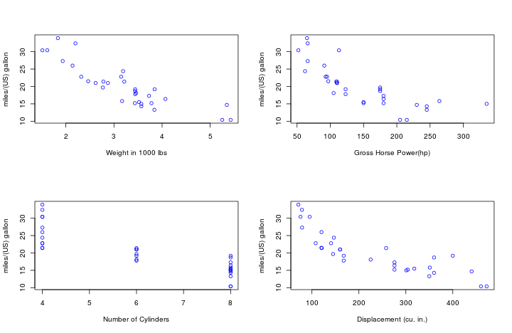

## Objective

Objective of this presentation is provide to update on following after analyzing the The data was extracted from the 1974 _Motor Trend_ US magazine, and comprises fuel consumption and 10 aspects of automobile design and performance for 32 automobiles (1973-74 models). 

* Exploratory Analysis
* Fit a Liner model to estimate the miles/(US) gallon
* Summary
    
### Data Points

<u>mpg</u> : Miles/(US) gallon,  <u>cyl</u> : Number of cylinders, <u>disp</u> : Displacement (cu.in.)
<br><u>hp</u> : Gross horsepower,<u>drat</u> : Rear axle ratio, <u>wt</u> : Weight (lb/1000)
<br><u>qsec</u> : 1/4 mile time,<u>vs</u> : V/S, <u>am</u> : Transmission (0 = automatic, 1 = manual)
<br><u>gear</u> : Number of forward gears, <u>carb</u> : Number of carburetors

---

## Exploratory Analysis
Follwing charts shows the relationship between various predictors and the outcome miles/(US) gallon

 


---

## Linear Model

We use number of cylenders, horse power, weight as the <em>predictors</em> and the <em>outcome</em> as miles/(US) gallon


Displacement has a strong relationship with number of cylinders, corelation coffecient = 0.902
Let's consider # of clylinders instead of displacement.

Here is our model


```r
modFit <- train(mpg ~ cyl + wt + hp + am, method = "lm", data = training)
mpg_predict <- predict(modFit, newdata = testing)
```


---

## Summary

*  All of the predictors have negative relationship with miles/(US) gallon
*  Holdinng all other predictors constatnt, Automatic transmission is more effecient than manual transition

You can use <a href="http://sdonapar.shinyapps.io/myshinyapp">"Predict Your Car Milage"</a> for interactive application


